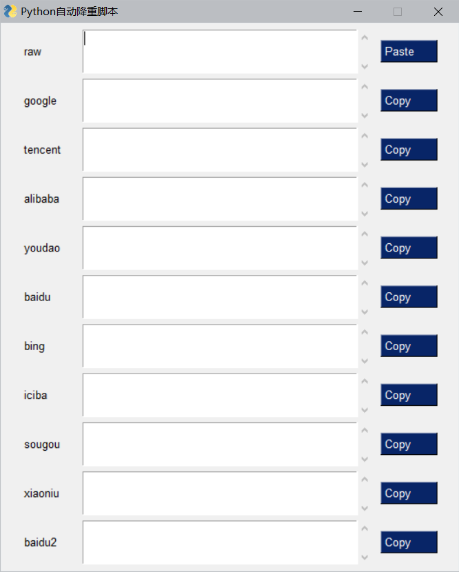

# 机器翻译自动降重

调用机器翻译 API 进行语句降重.
默认是从中文翻译成英文再翻译为中文.
百度 2 接口提供同义词随机替换功能.

## 使用方法

### 依赖

首先您可能需要安装以下库:

```bash
pip install PySimpleGUI translator execjs pyinstaller
```

### 运行或构建

使用以下命令直接运行脚本

```bash
git clone https://github.com/trotsky1997/AutoRepeater.git
cd AutoRepeater
python main.py
```

使用以下命令直接构建可执行程序(pyinstaller)

```bash
git clone https://github.com/trotsky1997/AutoRepeater.git
cd AutoRepeater
python -m pyinstaller -F -w main.py --hidden-import=queue
```

构建完成的可执行程序在`./dist/`目录下.

### 使用方法



`复制`需要降重的文本,点击`paste`,等待程序处理后点击`Copy`复制降重后的文本.

## 声明

源代码使用参见 LISENSE 文件,编译后程序不得商用,造成的一切后果与作者无关.
